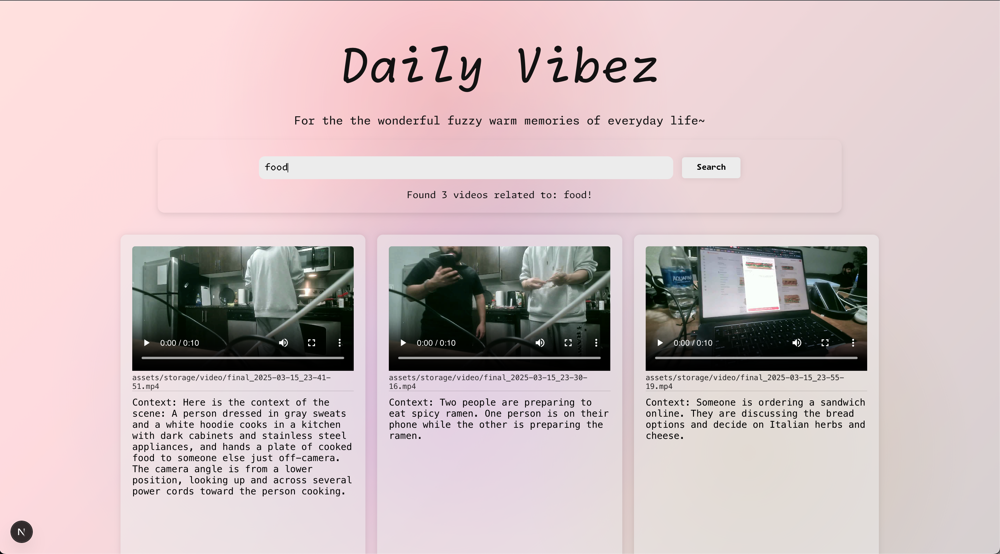
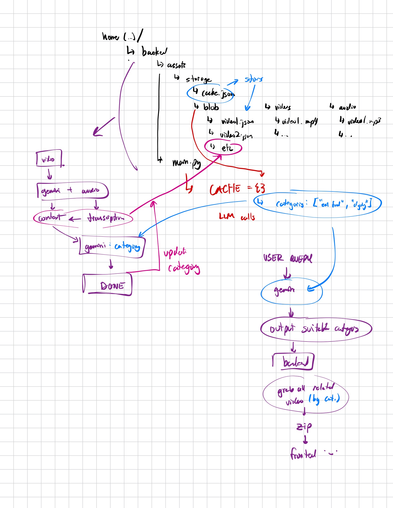

# QNX cuHacking -- Daily Vibez -- Project



## Description

This full-stack application features:

- A **Next.js** frontend built with **React** components that provides a dynamic user interface for video search, viewing, and immersive playback visuals including morphing gradients.
- A **FastAPI** backend responsible for:
  - Video processing, including file streaming, metadata extraction, transcription, and AI-driven context description generation using Gemini.
  - Exposing endpoints for video search, streaming, and context retrieval.
- An optional **camera module** that captures and processes real-time video clips, integrating seamlessly with the project's video processing pipeline.

## How to Run

### 1. Frontend

- **Navigate** to the frontend directory.
- **Install dependencies** using your preferred package manager (npm, yarn, or pnpm).
- **Start the development server** with:
  ```
  npm run dev
  ```
- Open your browser at [http://localhost:3000](http://localhost:3000) to view the application.

### 2. Backend

- **Navigate** to the server directory.
- **Install required Python packages** by referring to `requirements.txt`:
  ```
  pip install -r requirements.txt
  ```
- **Start the FastAPI server** using the following command:
  ```
  uvicorn search:app --reload
  ```
- The server provides endpoints for video search, video file streaming, and context analysis.

### 3. Camera Module (Optional)

- Run `camera_input.py` to continuously record and merge video and audio clips.
- This module supports real-time capture and integrates with the processing pipeline for new video content additions.

## Authors + Devpost Information

Here's a bit more about us:

| Left (our faces)                             | Right (linkedins hehe)                                                                                                                                                                                                                                                                                                                                                                  |
| -------------------------------------------- | --------------------------------------------------------------------------------------------------------------------------------------------------------------------------------------------------------------------------------------------------------------------------------------------------------------------------------------------------------------------------------------- |
|       | **[Peter Zhang](https://www.linkedin.com/in/peterzhang1/)**: Peter (me) – a 2nd year Computer Engineering student at the University of Waterloo. I worked on both the frontend and backend, including video search, playback, context generation, and the Gemini API setup. I contributed to all project components. Did you like the UI? That was me :)                                |
|  | **[Robby Sodhi](https://www.linkedin.com/in/robby-sodhi/)**: Robby Sodhi – the guy you've probably seen in our demo videos. As a 2nd year Computer Engineering student at the University of Waterloo, he worked on the camera module and the video processing pipeline, including real-time capture and processing. He also contributed to the backend, frontend, and Gemini API setup. |
|      | **[Sehaj Dhupia](https://www.linkedin.com/in/sehaj-dhupia/)**: Sehaj – a 2nd year Computer Engineering student at the University of Waterloo. He contributed to the frontend and backend, including video search, playback, and context generation, along with the Gemini API and video processing pipeline. Note that his focus was mostly on the frontend.                            |

## The Design Plan Document Thing

[Here's the link to our Devpost submission](https://devpost.com/software/timeless-ai-olbzuw)

ALSO before you get confused...

Here's another link.

It's to our notion page: [Notion Planning Page](https://cyan-pine-4d3.notion.site/Hackathon-cuhacking-1b75eca3b9df804dad91e6c59c6350ff?pvs=4)


